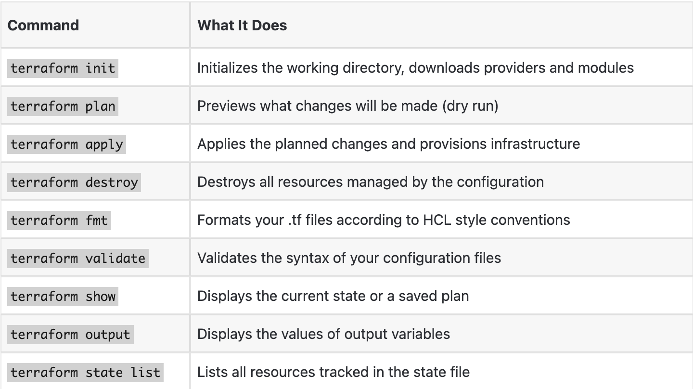

# TERRAFROM KNOWLEDGE BASE

## How Terraform Works: Core Concepts

### The Terraform workflow

Terraform follows a simple three-step cycle:

1. **Write** - Define your infrastructure in `.tf` configuration files using HCL (HashiCorp Configuration Language).
2. **Plan** — Run `terraform plan` to preview what Terraform will create, change, or destroy.
3. **Apply** — Run `terraform apply` to execute the plan and provision your infrastructure

### Key terminology

- **Provider** — A plugin that lets Terraform talk to a specific platform (e.g., AWS, Azure, GCP). Providers expose resources and data sources.
- **Resource** — A single piece of infrastructure, like an EC2 instance, S3 bucket, or VPC.
- **State file** — A JSON file (`terraform.tfstate`) that records the current state of your infrastructure.
- **Module** — A reusable package of Terraform configurations. Think of it as a function for infrastructure.
- **Data source** — Lets you read information from existing infrastructure (rather than creating something new).
-  **Variable** — An input parameter that makes your configurations reusable.
- **Output** — A value exported from your Terraform configuration, like an instance’s public IP.

## Core Terraform Commands 

**Good habit:** Always run `terraform plan` before `terraform apply`. Review the plan carefully — Terraform will show you exactly what it’s going to create, change, or destroy. Never skip this step.