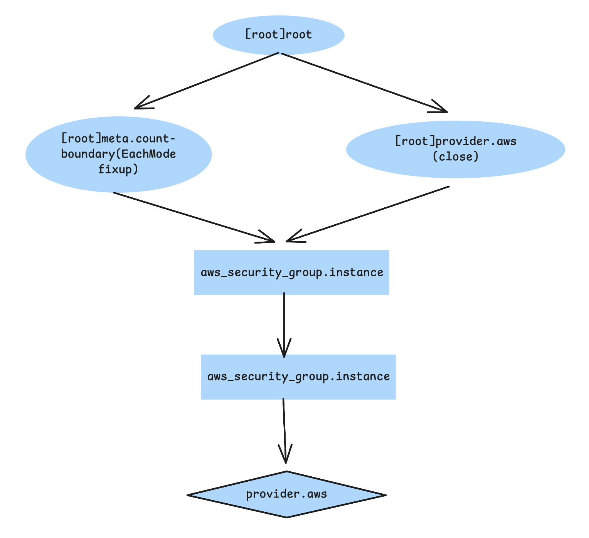

# DEPLOY A SINGLE WEB SERVER

## Port Numbers

The reason this example uses port 8080, rather than the default HTTP port 80, is that listening on any port less than 1024 requires root user
privileges. This is a security risk, because any attacker who manages to compromise your server would get root privileges, too.

The `<<-EOF` and `EOF` are Terraform’s *heredoc syntax*, which allows you to create multiline strings without having to insert newline characters all over the place.

## How to Deploy

By default, AWS does not allow any incoming or outgoing traffic from an EC2 instance. To allow the EC2 Instance to receive traffic on port 8080, you need to create a *security group*.

*CIDR blocks* are a concise way to specify IP address ranges. For example, a CIDR block of 10.0.0.0/24 presents all IP addresses between 10.0.0.0 and 10.0.0.255. The CIDR block 0.0.0.0/0 is an IP address range that includes all possible IP addresses, so this security group allows incoming requests on port 8080 from an IP.

Simply creating a security group isn’t enough; you also need to tell the EC2 Instance to actually use it by passing the ID of the security group
into the `vpc_security_group_ids` argument of the `aws_instance` resource. 

An expression in Terraform is anything that returns a value. You’ve already seen the simplest type of expressions, *literals*, such as strings
(e.g., `"ami-0c55b159cbfafe1f0"`) and numbers (e.g., 5).

One particularly useful type of expression is a *reference*, which allows you to access values from other parts of your code. To access the ID of the security group resource, you are going to need to use a *resource attribute reference*, which uses the following syntax:

```
<PROVIDER>_<TYPE>.<NAME>.<ATTRIBUTE>
```

- PROVIDER: name of the provider (e.g., `aws`)
- TYPE: the type of resource (e.g., `security_group`)
- NAME: the name of that resource (e.g., the security group is named "instance")
- ATTRIBUTE: either one of the arguments of that resource (e.g. name) or one of the attributes *exposed* by the resource

The security group exports an attribute called `id`, so the expression to reference it will look like this:

```
aws_security_group.instance.id
```

You can use this security group ID in the `vpc_security_group_ids` argument of the `aws_instance`. When you add a reference from one source to another, you create an *implicit dependency*. Terraform parses these dependencies, builds a dependency graph from them, and uses that to automatically determine in which order it should create resources.

